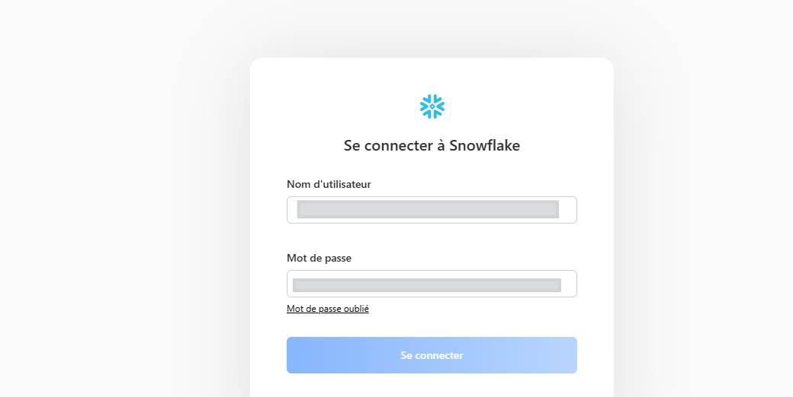
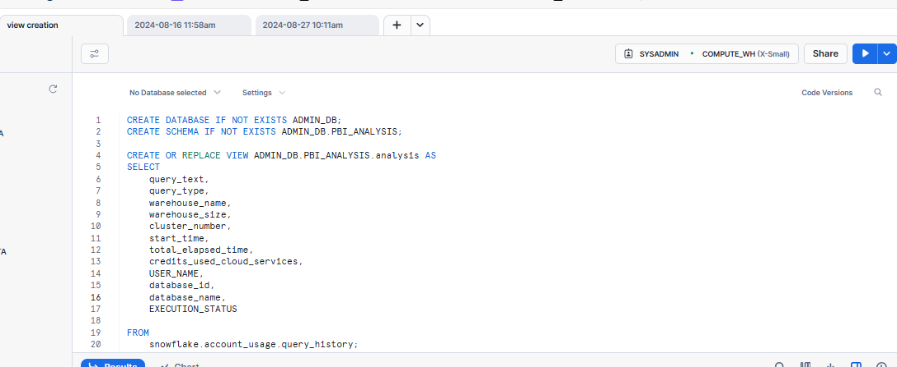
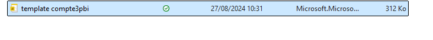
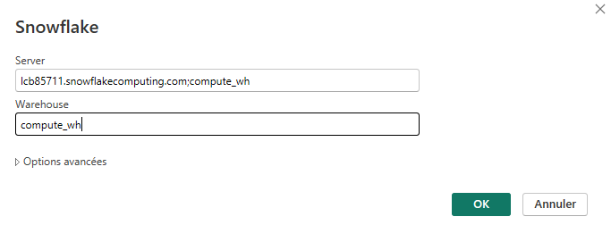
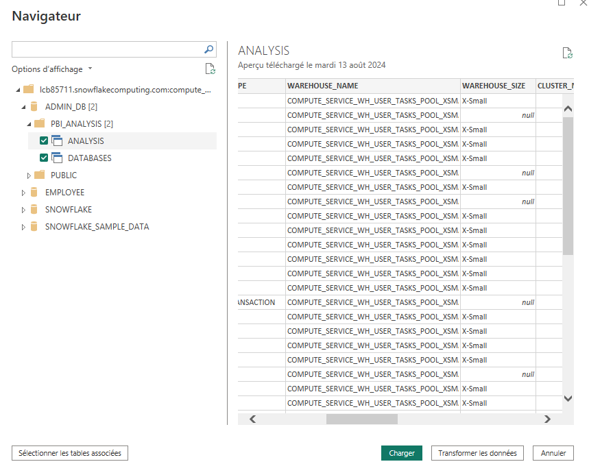
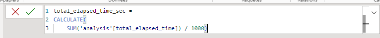
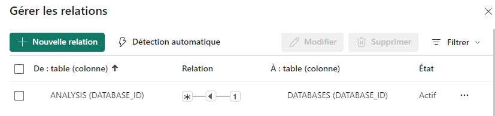
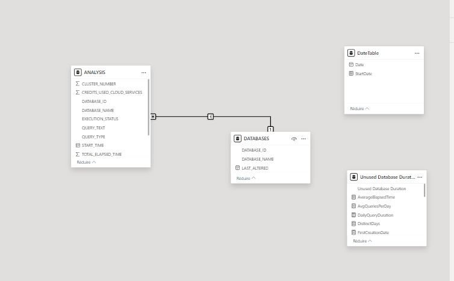
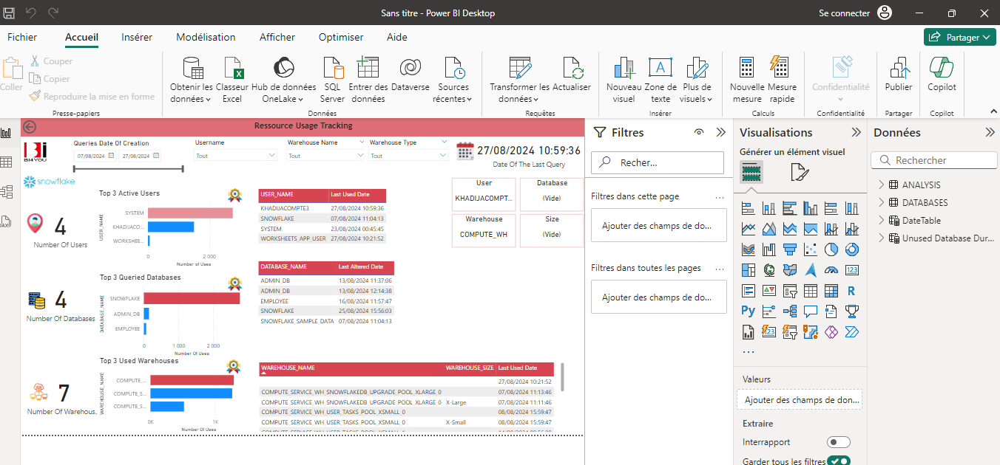

# Khadijaenn-performance-analyzation-in-Snowflake
# Guide to the Power BI Dashboard (Using Snowflake)

## Step 1: Connect to Snowflake

## Step 2: Create Views for the Power BI Dashboard


Source Code:
```sql
CREATE DATABASE IF NOT EXISTS ADMIN_DB;
CREATE SCHEMA IF NOT EXISTS ADMIN_DB.PBI_ANALYSIS;

CREATE OR REPLACE VIEW ADMIN_DB.PBI_ANALYSIS.analysis AS
SELECT 
    query_text,
    query_type,
    warehouse_name,
    warehouse_size,
    cluster_number,
    start_time,
    total_elapsed_time,
    credits_used_cloud_services,
    USER_NAME,
    database_id,
    database_name,
    EXECUTION_STATUS
FROM 
    snowflake.account_usage.query_history;

SELECT * FROM analysis 
LIMIT 5;

CREATE OR REPLACE VIEW ADMIN_DB.PBI_ANALYSIS.databases AS
SELECT DATABASE_ID, DATABASE_NAME, LAST_ALTERED 
FROM snowflake.account_usage.databases;
```

## Step 3: Open the Created Template in Power BI


## Step 4: Connect to the Database (Snowflake Source)


## Step 5: Select the Database
Choose the database you previously created.


## Step 6: Make Necessary Adjustments
Add the calculated column total_elapsed_time_sec to the analysis table to ensure all measures work correctly:


Source Code:

```sql
total_elapsed_time_sec = 
CALCULATE(
    SUM('analysis'[total_elapsed_time]) / 1000
)
```
Establish the necessary relationships:


Your model should look like this:


 
## Step 7: Visualize the Dashboard

